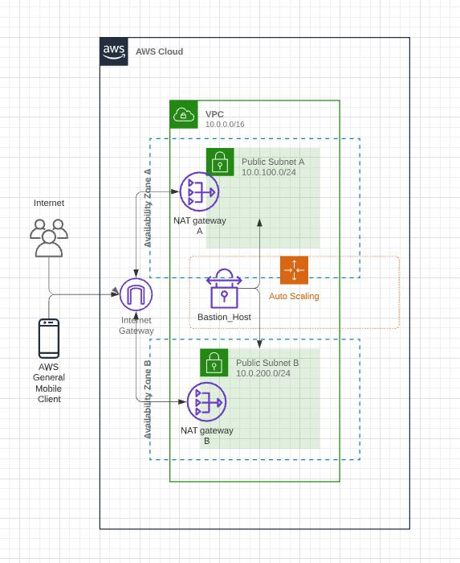

# This is IaC Terrafrom for the Bastion AWS with configuration of ASG

The system has set up an auto-scaling group. If the Bastion host will be terminated or stopped, after 1 min ASG starts the Bastion again with the same elastic IP automatically. /> 
Because the Infrastructure has a high level of availability, and every region has at least two AZ, deploying uses two subnets (by default)  into 2 AZ each. /> 

The system allows you to choose the following various: />
1) Region />
2) Type of EC2 />
3) Tags />
4) Your own awsAccessKey />
5) Your own awsSecretKey />

Note: if the user will choose to create his own ssh-keygen, he needs to upload the ssh-public key in the folder of this project />

Creating an AWS IAM role using Terraform 
Creating an IAM policy using Terraform 
Attaching the policy to the role using Terraform 
Creating the IAM instance profile using Terraform 
Assigning the IAM role to an EC2 instance on the fly using Terraform  
SSH - Please choose your own keys or create via ssh-keygen, in the code, you can find the name of the key and modify it
